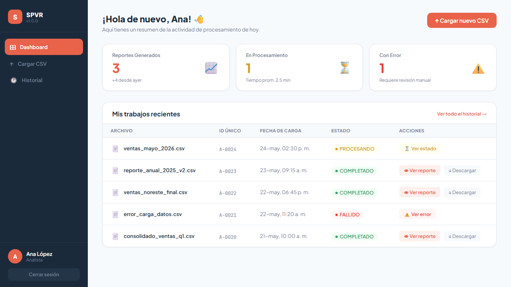
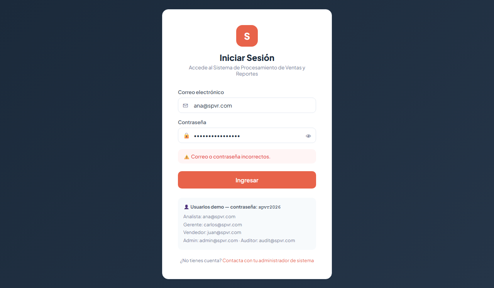
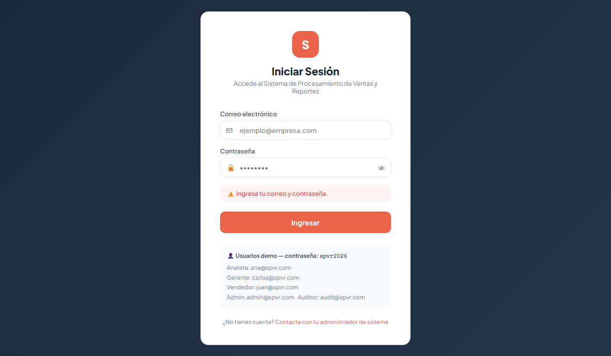
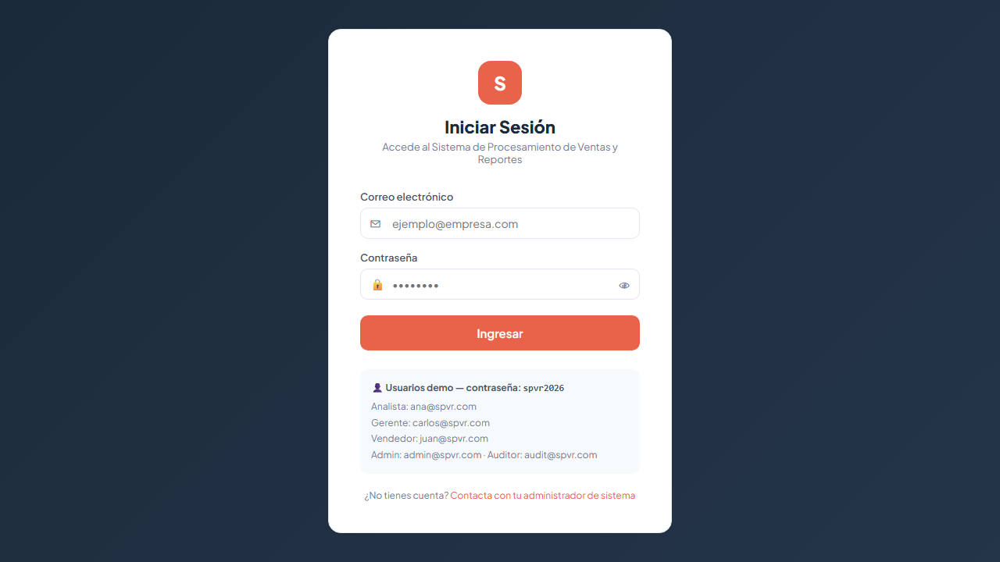
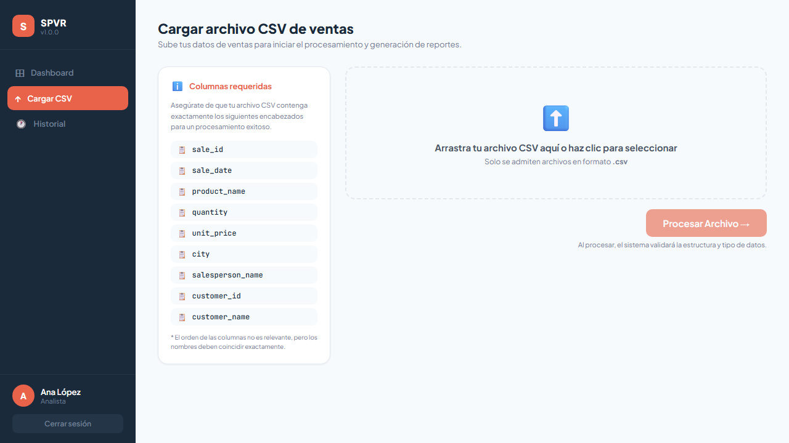
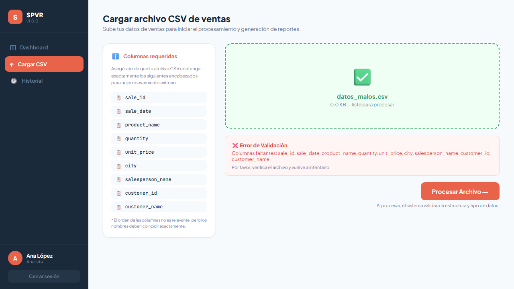
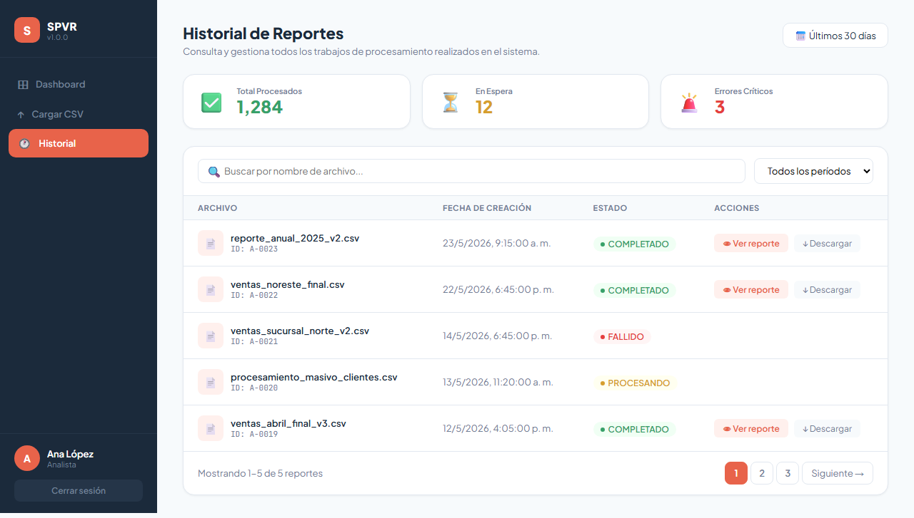
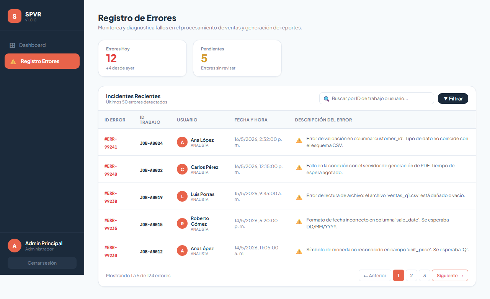

# Sistema de Procesamiento de Ventas y Reportes (SPVR) — Pruebas Automáticas

Universidad Galileo — FISICC, Postgrado en Diseño y Desarrollo de Software

##  Descripción del proyecto

Este repositorio contiene la suite de 10 pruebas automáticas de interfaz gráfica desarrolladas para el Sistema de Procesamiento de Ventas y Reportes (SPVR), como parte del laboratorio de Pruebas Automáticas del curso. Las pruebas fueron construidas con Playwright y ejecutadas en modo demo (sin integración con AWS), validando los flujos principales de autenticación, navegación, carga de archivos, control de acceso por roles y visualización de datos del sistema.

**Resultado final: 10 de 10 escenarios PASARON**

## Objetivo del laboratorio

Diseñar y automatizar 10 escenarios de prueba de interfaz gráfica para la aplicación asignada, cubriendo casos funcionales y de seguridad, documentando cada escenario con su precondición, pasos, resultado esperado, resultado obtenido y evidencia (captura de pantalla).

## Integrantes

- Diego Alejandro Sican Olivares
- Sandra Daniela Soria Palma
- Gabriela Lucia Navarro de León

## Tecnologías y herramientas utilizadas

- **Playwright** (Node.js) como framework de automatización de pruebas E2E
- **Node.js / npm** para la gestión de dependencias y ejecución de scripts
- Navegador **Chromium** (motor por defecto de Playwright) para la ejecución de los escenarios
- Aplicación SPVR corriendo localmente en `http://localhost:3000` (modo demo, sin backend/AWS real)

## Estructura del proyecto

```
.
├── Frontend/
│   ...
│   ├── tests/
│   │   ├── EP-01-login-exitoso.spec.ts
│   │   ├── EP-02-login-password-incorrecta.spec.ts
│   │   ├── EP-03-login-campos-vacios.spec.ts
│   │   ├── EP-04-logout.spec.ts
│   │   ├── EP-05-ruta-protegida.spec.ts
│   │   ├── EP-06-dashboard-lista-jobs.spec.ts
│   │   ├── EP-07-navegacion-cargar-csv.spec.ts
│   │   ├── EP-08-upload-columnas-incorrectas.spec.ts
│   │   ├── EP-09-historial-reportes.spec.ts
│   │   └── EP-10-control-roles-admin.spec.ts
│   ├── test-results/
│   │   └── .last-run.json
│   ├── playwright.config.ts
│   ├── package.json
│   └── README.md
├── Laboratorio_Pruebas_Automaticas_SPVR.pdf   # Documento de evidencias y resultados

```

## Resumen de resultados

| ID | Escenario | Tipo | Resultado |
|----|-----------|------|-----------|
| EP-01 | Login exitoso como Analista | Funcional | PASÓ |
| EP-02 | Login fallido — contraseña incorrecta | Funcional | PASÓ |
| EP-03 | Login fallido — campos vacíos | Funcional | PASÓ |
| EP-04 | Logout — cierra sesión y regresa al login | Funcional | PASÓ |
| EP-05 | Ruta protegida — sin sesión muestra login | Seguridad | PASÓ |
| EP-06 | Dashboard Analista — muestra lista de jobs | Funcional | PASÓ |
| EP-07 | Navegación — ir a Cargar CSV desde el sidebar | Funcional | PASÓ |
| EP-08 | Upload — rechaza CSV con columnas incorrectas | Funcional | PASÓ |
| EP-09 | Historial — muestra reportes anteriores | Funcional | PASÓ |
| EP-10 | Control de roles — Admin ve Registro de Errores | Seguridad | PASÓ |

**Total: 10/10 escenarios PASARON.**

## Escenarios de prueba detallados

A continuación se presenta el detalle completo de cada uno de los 10 escenarios, tal como fueron diseñados y ejecutados. 

### EP-01 Login exitoso como Analista

| Campo | Detalle |
|---|---|
| **Tipo** | Funcional / Autenticación |
| **Precondición** | La aplicación está corriendo en localhost:3000. El usuario ana@spvr.com existe en el sistema con contraseña spvr2026. |
| **Pasos** | 1. Abrir la aplicación en el navegador.<br>2. Ingresar el correo: ana@spvr.com<br>3. Ingresar la contraseña: spvr2026<br>4. Hacer clic en el botón "Ingresar". |
| **Resultado esperado** | El sistema autentica al usuario y muestra el Dashboard con el mensaje "¡Hola de nuevo, Ana! 👋" y la sección "Mis trabajos recientes". |
| **Estado** | ✅ PASÓ |


### EP-02 Login fallido — contraseña incorrecta

| Campo | Detalle |
|---|---|
| **Tipo** | Funcional / Validación de errores |
| **Precondición** | La aplicación está corriendo. El usuario ana@spvr.com existe en el sistema. |
| **Pasos** | 1. Abrir la aplicación en el navegador.<br>2. Ingresar el correo: ana@spvr.com<br>3. Ingresar una contraseña incorrecta: clave_incorrecta<br>4. Hacer clic en el botón "Ingresar". |
| **Resultado esperado** | El sistema muestra el mensaje de error: "Correo o contraseña incorrectos." El usuario permanece en la pantalla de login. |
| **Estado** | ✅ PASÓ |


### EP-03 Login fallido — campos vacíos

| Campo | Detalle |
|---|---|
| **Tipo** | Funcional / Validación de formulario |
| **Precondición** | La aplicación está corriendo en el navegador. |
| **Pasos** | 1. Abrir la aplicación en el navegador.<br>2. No ingresar ningún dato en los campos de correo ni contraseña.<br>3. Hacer clic directamente en el botón "Ingresar". |
| **Resultado esperado** | El sistema muestra el mensaje: "Ingresa tu correo y contraseña." El usuario permanece en la pantalla de login sin que se realice ninguna petición. |
| **Estado** | ✅ PASÓ |



### EP-04 Logout — cierra sesión y regresa al login

| Campo | Detalle |
|---|---|
| **Tipo** | Funcional / Seguridad de sesión |
| **Precondición** | El usuario ana@spvr.com ha iniciado sesión correctamente. |
| **Pasos** | 1. Desde el Dashboard, localizar el botón "Cerrar sesión" en el sidebar.<br>2. Hacer clic en "Cerrar sesión".<br>3. Verificar que el localStorage fue limpiado. |
| **Resultado esperado** | El sistema elimina el token y los datos del usuario del localStorage, y redirige al usuario a la pantalla de login. |
| **Estado** | ✅ PASÓ |



### EP-05 Ruta protegida — sin sesión muestra login

| Campo | Detalle |
|---|---|
| **Tipo** | Seguridad / Control de acceso |
| **Precondición** | El navegador no tiene sesión activa (localStorage vacío). |
| **Pasos** | 1. Abrir la aplicación directamente en localhost:3000 sin haber iniciado sesión.<br>2. Verificar qué pantalla se muestra. |
| **Resultado esperado** | El sistema muestra únicamente la pantalla de login. No se muestran elementos del sistema interno como "Cargar CSV" o "Historial". |
| **Estado** | ✅ PASÓ |


### EP-06 Dashboard Analista — muestra lista de jobs

| Campo | Detalle |
|---|---|
| **Tipo** | Funcional / Visualización de datos |
| **Precondición** | El usuario ana@spvr.com ha iniciado sesión correctamente. |
| **Pasos** | 1. Iniciar sesión como ana@spvr.com con contraseña spvr2026.<br>2. Verificar el contenido del Dashboard. |
| **Resultado esperado** | El Dashboard muestra la sección "Mis trabajos recientes" con el listado de trabajos del usuario, incluyendo sus estados (PROCESANDO, COMPLETADO, FALLIDO). |
| **Estado** | ✅ PASÓ |


### EP-07 Navegación — ir a Cargar CSV desde el sidebar

| Campo | Detalle |
|---|---|
| **Tipo** | Funcional / Navegación |
| **Precondición** | El usuario ana@spvr.com ha iniciado sesión correctamente. |
| **Pasos** | 1. Iniciar sesión como ana@spvr.com.<br>2. Hacer clic en "Cargar CSV" en el menú lateral.<br>3. Verificar que la pantalla correcta se muestra. |
| **Resultado esperado** | El sistema navega a la pantalla "Cargar archivo CSV de ventas" con el formulario de carga y la lista de columnas requeridas. |
| **Estado** | ✅ PASÓ |

 
### EP-08 Upload — rechaza CSV con columnas incorrectas

| Campo | Detalle |
|---|---|
| **Tipo** | Funcional / Validación de datos |
| **Precondición** | El usuario ana@spvr.com ha iniciado sesión y está en la pantalla de Cargar CSV. |
| **Pasos** | 1. Iniciar sesión como ana@spvr.com.<br>2. Navegar a "Cargar CSV".<br>3. Seleccionar un archivo CSV con columnas incorrectas (nombre, apellido, edad).<br>4. Hacer clic en "Procesar Archivo". |
| **Resultado esperado** | El sistema valida las columnas del archivo y muestra el mensaje "Columnas faltantes" indicando cuáles columnas requeridas no están presentes. |
| **Estado** | ✅ PASÓ |



### EP-09 Historial — muestra reportes anteriores

| Campo | Detalle |
|---|---|
| **Tipo** | Funcional / Visualización de datos |
| **Precondición** | El usuario ana@spvr.com ha iniciado sesión correctamente. |
| **Pasos** | 1. Iniciar sesión como ana@spvr.com.<br>2. Hacer clic en "Historial" en el menú lateral.<br>3. Verificar que la pantalla de historial carga correctamente. |
| **Resultado esperado** | El sistema muestra la pantalla "Historial de Reportes" con el listado de reportes generados anteriormente, incluyendo nombre de archivo, fecha, estado y acciones. |
| **Estado** | ✅ PASÓ |



### EP-10 Control de roles — Admin ve Registro de Errores

| Campo | Detalle |
|---|---|
| **Tipo** | Seguridad / Control de acceso por rol |
| **Precondición** | El usuario admin@spvr.com existe en el sistema con rol de administrador. |
| **Pasos** | 1. Iniciar sesión como admin@spvr.com con contraseña spvr2026.<br>2. Verificar qué opciones aparecen en el menú lateral.<br>3. Hacer clic en "Registro Errores". |
| **Resultado esperado** | El administrador ve el menú con "Registro Errores" pero NO ve en el menú lateral "Cargar CSV" que es exclusivo del analista. La pantalla de errores muestra el log del sistema. |
| **Estado** | ✅ PASÓ |



## Requisitos previos

- [Node.js](https://nodejs.org/) v18 o superior
- npm (incluido con Node.js)
- La aplicación SPVR corriendo localmente en modo demo, accesible en `http://localhost:3000`

## Instalación

1. Clonar el repositorio:
   ```bash
   git clone https://github.com/sandra381/Lab_pruebas_auto.git
   cd Lab_pruebas_auto
   ```

2. Instalar las dependencias del proyecto:
   ```bash
   npm install
   ```

3. Instalar los navegadores que utiliza Playwright (Chromium, Firefox, WebKit):
   ```bash
   npx playwright install
   ```

4. Levantar la aplicación SPVR en modo demo (en otra terminal, según las instrucciones del proyecto de la app):
   ```bash
   npm run dev
   # La aplicación deberá quedar disponible en http://localhost:3000
   ```

## Usuarios de prueba (modo demo)

| Rol | Correo | Contraseña |
|-----|--------|------------|
| Analista | ana@spvr.com | spvr2026 |
| Gerente | carlos@spvr.com | spvr2026 |
| Vendedor | juan@spvr.com | spvr2026 |
| Administrador | admin@spvr.com | spvr2026 |
| Auditor | audit@spvr.com | spvr2026 |

## Ejecución de las pruebas

Con la aplicación corriendo en `http://localhost:3000`, ejecutar las pruebas con cualquiera de los siguientes comandos:

**Ejecutar toda la suite de pruebas (modo headless):**
```bash
npx playwright test
```

**Ejecutar las pruebas en modo visual (con navegador visible):**
```bash
npx playwright test --headed
```

**Ejecutar las pruebas con la interfaz interactiva de Playwright (UI Mode):**
```bash
npx playwright test --ui
```

**Ejecutar un escenario específico (por ejemplo, EP-01):**
```bash
npx playwright test --grep "EP-01" --headed
```

**Ejecutar las pruebas en un navegador específico:**
```bash
npx playwright test --project=chromium
```

**Ejecutar las pruebas en modo debug (paso a paso):**
```bash
npx playwright test --debug
```

## Ver el reporte de resultados

Playwright genera un reporte HTML con el detalle de cada prueba, capturas de pantalla y trazas de ejecución. Para visualizarlo:

```bash
npx playwright show-report
```

Esto abrirá el reporte en el navegador, mostrando los 10 escenarios y su estado (PASÓ / FALLÓ), junto con las capturas de pantalla generadas automáticamente.

## Modo de ejecución: Demo (sin AWS)

Las pruebas se ejecutaron contra una versión demo de SPVR que no depende de servicios de AWS (sin S3, sin Lambda, sin RDS real). Los datos de usuarios, trabajos y reportes utilizados en los escenarios son datos simulados (mock) servidos localmente, lo que permite ejecutar la suite completa de forma reproducible sin necesidad de credenciales en la nube.
